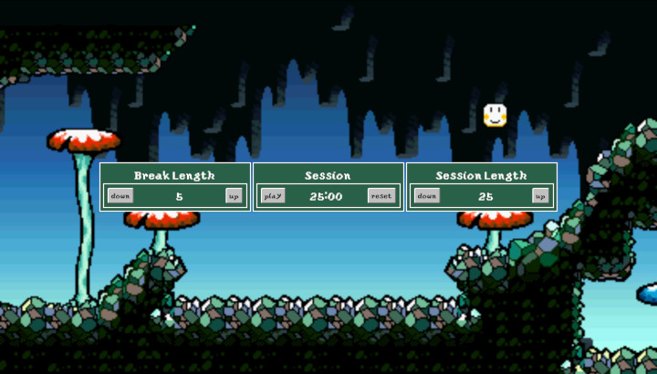

# Pomodoro Clock
A Yoshi's Island-themed pomodoro clock.

## Purpose/Goal
To learn how to work with timers and intervals in JavaScript.

## Operation
* Click on the "down" and "up" buttons to change the interval times.
* Click "play" to start and pause the clock and "reset" to reset all the values.

## Tech/Libraries Used
* HTML
* CSS
* JavaScript
* React

## Problems/Solutions
* Had issues getting the audio tag to work at first, but [this post](https://stackoverflow.com/questions/48748063/react-refs-audio-playback-unhandled-rejection-notsupportederror-on-ios) and [this one](https://reactjs.org/docs/refs-and-the-dom.html) helped me through it.

## More Information
This project was a requirement for a Free Code Camp certification.
